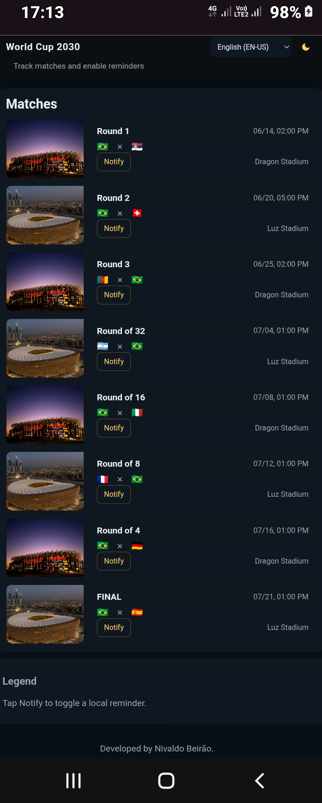

# Creating a Kotlin App to Follow the World Cup

Project developed during the Santander Bootcamp 2023 - Mobile Android with Kotlin, under the guidance of experts [Pedro Silva](https://github.com/pedrox-hs "Pedro Silva"), [Ezequiel Messore](https://github.com/EzequielMessore "Ezequiel Messore"), [Igor Rotondo Bagliotti](https://github.com/igorbag "Igor Rotondo Bagliotti") e [Venilton FalvoJr](https://github.com/falvojr "Venilton FalvoJr").

Learn how to create an app featuring a schedule and notifications for Brazil's World Cup matches. To do this, explore key Android Jetpack features and best practices for native Android app development.

## Features

- Responsive layout with semantic HTML and accessible controls.
- Dark / Light mode with moon/sun icons (dark is default).
- Multilanguage support: **EN-US** (default), **PT-BR**, **ES**.
- Matches rendered from a JSON-like data structure.
- Notify toggle per match (state persisted in `localStorage`).
- Keyboard accessible and screen-reader friendly.

## Tecnologies

## Mobile & Core

- **Kotlin**: (TO DO - preencher com a utilização da tecnologia Kotlin no projeto - em inglês)

## Assistive & Acessibility

- **AI (Assistive)**: (TO DO - preencher com a utilização da tecnologia IA Assistiva no projeto - em inglês)

### Additional

- **HTML5**: main markup and templates.
- **CSS3**: responsive styles and theme variables.
- **JavaScript**: rendering, theme & language logic, local persistence.

## Setup

1. Clone or copy files into a folder.
2. Create an `assets/` folder at the project root and add stadium images:
   - `assets/luz-stadium.png`
   - `assets/dragon-stadium.png`
   - (use your own images; filenames must match those referenced in `script.js`)
3. Open `index.html` in a browser (no build step required).

## Accessibility & Best Practices

- Uses semantic elements (`header`, `main`, `section`, `article`, `footer`).
- Skip link for keyboard users.
- Buttons use `aria-pressed` and `aria-label`.
- Live region announces notification toggle changes.
- Focusable cards and keyboard handlers for Enter/Space.
- Respects `prefers-color-scheme` and persists user theme choice.

## Customization

- Replace `matchesData` in `script.js` with your own JSON or fetch from an API.
- Adjust `i18n` object to add or refine translations.
- Add real notification scheduling (Service Worker / Push API) if needed - this demo only toggles state locally.

## Design Challenge (Lab)

- Explore the base project and understand its modules and responsibilities:
  - **app**: Contains the application-level classes and scaffolding that tie the rest of the codebase together. The "app" module depends on all necessary feature modules and core modules;
  - **data**: An abstraction for data source access, organized as follows:
        - ***data***: This module declares the "remote" and "local" DataSources, as well as repository implementations based on the required business logic;
        - ***local***: Contains a [Room](https://developer.android.com/training/data-storage/room) implementation serving as the local data source;
        - ***remote***: Implementation of a remote data source using [Retrofit](https://square.github.io/retrofit/) as the HTTP client.
  - **domain**: This module declares the application's use cases (functionalities);
  - **notification-scheduler**: A module dedicated to creating notifications using WorkManager.
- Create the use cases for the following features:
  - Search Matches: `GetMatchesUseCase.kt`;
  - Enable Notification: `EnableNotificationUseCase.kt`;
  - Disable Notification: `DisableNotificationUseCase.kt`.
- Create `MainViewModel.kt` to orchestrate interactions with `MainActivity.kt`;
- Create `MainScreen.kt` to build the UI using Jetpack Compose;
- Integrate the ViewModel and Activity by observing state;
- Finally, create the WorkManager to orchestrate local push notifications.

## Modules

- **app** - Application entrypoint, UI, activities, Compose screens.
- **data** - Data layer with `remote` (Retrofit) and `local` (Room) implementations and repository wiring.
  - `data` (root): repository implementations and data sources.
  - `data/local`: Room entities, DAOs, database.
  - `data/remote`: Retrofit DTOs and API client.
- **domain** - Business models and use cases (GetMatches, EnableNotification, DisableNotification).
- **notification-scheduler** - WorkManager worker and scheduling helpers.

## Key Features

- Fetch matches from a JSON API (or local asset).
- Display matches with stadium images using Coil.
- Schedule local notifications using WorkManager (notify X minutes before match).
- Toggle notifications per match.
- Clean separation of concerns with use cases and repository pattern.

## Requirements

- Android Studio Flamingo or later
- JDK 11+
- Gradle 7.4+ (wrapper included)
- Minimum SDK: 21
- Target SDK: latest stable

## Setup & Run

1. **Clone repository**

    ```bash
    git clone <repo-url>
    cd world-cup-tracker
    ```

2. Open in Android Studio

    - Import the project using the Gradle wrapper.
    - Let Android Studio sync and download dependencies.

3. Configure API / JSON

    - By default the app can read a local ``api.json`` in ``app/src/main/assets/``.
    - To use a remote endpoint, update the Retrofit base URL in the data/remote module.

4. Run

    - Select an emulator or device and run the ``app`` module.

## WorkManager Notifications

- Notifications are scheduled with a ``OneTimeWorkRequest`` that runs at ``matchTime - notifyBeforeMinutes``.
- Use a unique work name per match (e.g., ``match_notification_unique_<matchId>``) to allow replace/cancel behavior.
- The ``NotificationWorker`` builds and posts a local notification using ``NotificationManager``.
- Important: Request runtime notification permission on Android 13+ (``POST_NOTIFICATIONS``) before scheduling.

## Dependencies (high level)

- Kotlin stdlib
- AndroidX Core, AppCompat
- Jetpack Compose (material3)
- Lifecycle (ViewModel, SavedState)
- Hilt (DI)
- Retrofit + Moshi / Gson
- OkHttp
- Room (runtime, ktx, compiler)
- WorkManager
- Coil Compose (image loading)
- Coroutines (core, android)
- Timber (optional logging)

Example Gradle (app-level) snippet:

```bash
implementation "androidx.core:core-ktx:1.10.1"
implementation "androidx.compose.ui:ui:1.5.0"
implementation "androidx.compose.material3:material3:1.1.0"
implementation "androidx.lifecycle:lifecycle-runtime-ktx:2.6.1"
implementation "com.google.dagger:hilt-android:2.47"
kapt "com.google.dagger:hilt-compiler:2.47"
implementation "com.squareup.retrofit2:retrofit:2.9.0"
implementation "com.squareup.retrofit2:converter-moshi:2.9.0"
implementation "androidx.room:room-runtime:2.6.1"
kapt "androidx.room:room-compiler:2.6.1"
implementation "androidx.work:work-runtime-ktx:2.8.1"
implementation "io.coil-kt:coil-compose:2.4.0"
implementation "org.jetbrains.kotlinx:kotlinx-coroutines-android:1.7.3"
```

## Testing

- Unit test use cases and repository logic with JUnit and Mockito / MockK.
- Use ``androidx.work:work-testing`` to test WorkManager scheduling.
- Compose UI tests with ``androidx.compose.ui:ui-test-junit4``.

## Notes & Best Practices

- Use ``Instant`` for timestamps and convert to local timezone for display.
- Persist user notification preferences in Room or DataStore so toggles survive restarts.
- Use ``enqueueUniqueWork`` with ``ExistingWorkPolicy.REPLACE`` to update scheduled notifications.
- Handle edge cases: past match times, device reboot (WorkManager persists across reboots), and permission denial.

GitHub Pages: [https://digitalinnovationone.github.io/copa-2022-android/api.json](https://digitalinnovationone.github.io/copa-2022-android/api.json), a pseudo-API created to facilitate the app's integration workflow.

If you have difficulty performing them on your own, feel free to consult her:
**[Android Mobile Week #2: Learn How to Create an App with a Schedule and Notifications for Brazil's World Cup Matches](https://youtu.be/30ZiJmCWliI)**



[LICENSE](/LICENSE)
